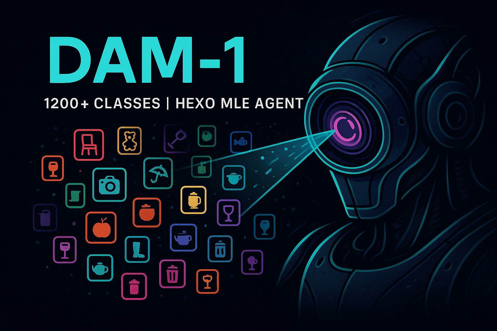
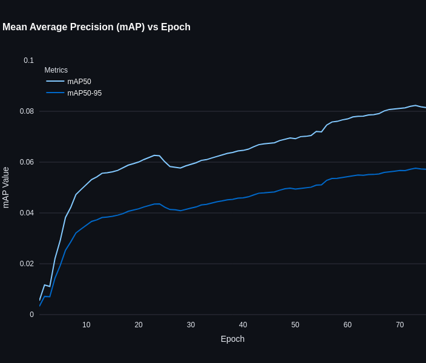
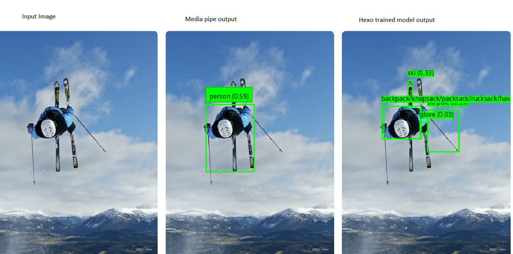
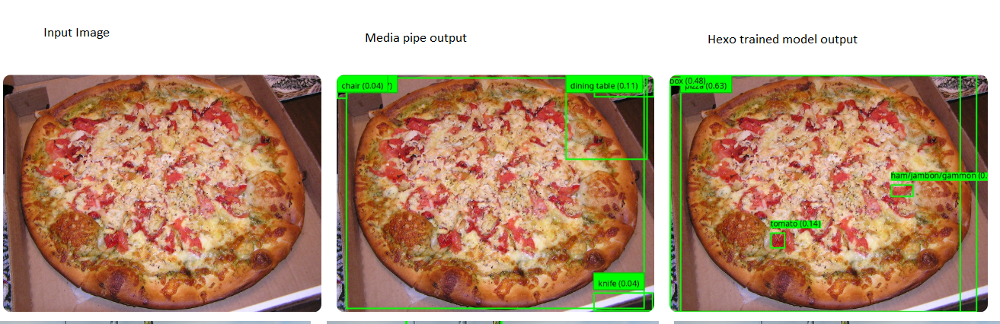
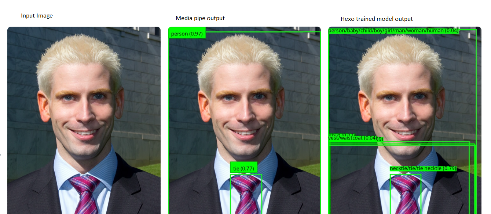
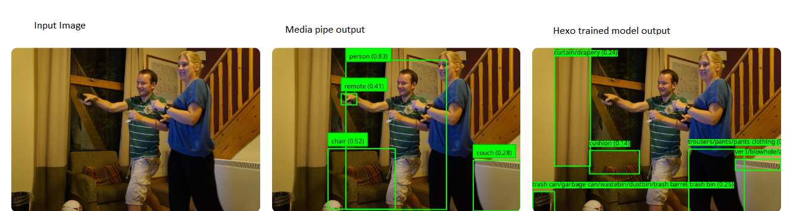
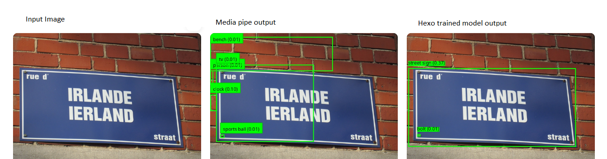

# DAM



A powerful object detection system built on YOLO (You Only Look Once) architecture, specifically fine-tuned for the LVIS (Large Vocabulary Instance Segmentation) dataset. This project provides both training and inference capabilities, along with a user-friendly Streamlit web interface for real-time object detection. The system is specifically designed to handle the challenges of large-scale object detection with many classes and imbalanced datasets.

## About DAM-1

DAM-1 (Detect Anything Model v1) is a breakthrough in large-scale object detection, capable of identifying objects across 1200 different classes. What makes this achievement even more remarkable is that it was entirely trained by the Hexo MLE agent - an autonomous AI system that successfully tackled one of the most challenging tasks in computer vision: training a large-scale object detection model to convergence.

To put this in perspective, Mediapipe - one of the most commonly used object detection models - can only predict 80 categories of objects. DAM-1 represents a 15x increase in detection capabilities, demonstrating the power of autonomous AI systems in solving complex machine learning challenges.

Learn more about the Hexo Agent and its capabilities at [hexo.ai](https://hexo.ai)

## Training Challenges

Training large-scale object detection models presents several significant challenges:

- **Class Imbalance**: The LVIS dataset exhibits severe class imbalance, with some classes having thousands of instances while others have only a few. This imbalance makes it difficult for the model to learn rare classes effectively.

- **Convergence Issues**: With 1203 different classes, achieving convergence is particularly challenging. The model needs to learn discriminative features for each class while maintaining good performance across all classes.

- **Computational Complexity**: Training on such a large number of classes requires significant computational resources and careful optimization of the training process.

- **Memory Constraints**: Handling a large number of classes and instances requires efficient memory management and optimization techniques.

Our implementation addresses these challenges through:
- Advanced sampling strategies to handle class imbalance
- Careful learning rate scheduling
- Gradient accumulation for effective batch processing
- Regularization techniques to prevent overfitting
- Progressive training approaches

## Features

- 🎯 **Large-Scale Detection**: YOLO-11n model fine-tuned for LVIS dataset with 1200+ object classes - 15x more categories than Mediapipe
- 🔍 **Comprehensive Coverage**: Detect virtually any object in your images with high accuracy
- 📊 Interactive web interface using Streamlit
- 🔄 Support for single image and batch processing
- 📈 Comprehensive evaluation metrics
- 🖼️ Real-time object detection with confidence scores
- 📝 Detailed detection results with bounding boxes
- 🚀 **Autonomous Training**: Successfully trained by Hexo MLE agent, demonstrating advanced AI capabilities

## Installation

1. Clone the repository:
```bash
git clone https://github.com/hexo-ai/dam.git
cd dam
```

2. Install dependencies:
```bash
pip install -r requirements.txt
```

## Usage

### Web Interface

Launch the Streamlit web interface:
```bash
streamlit run streamlit_app.py
```

The web interface provides three main features:
1. Single Image Prediction
2. Batch Prediction
3. Test Set Prediction

### Training

To train the model on your dataset:
```bash
python train.py
```

### Evaluation

To evaluate the model's performance:
```bash
python evaluate.py
```

## Project Structure

```
dam/
├── streamlit_app.py    # Web interface for object detection
├── train.py           # Training script
├── evaluate.py        # Evaluation script
├── requirements.txt   # Project dependencies
└── documentations/    # Additional documentation
```

## Dependencies

Key dependencies include:
- PyTorch
- Ultralytics YOLO
- Streamlit
- OpenCV
- NumPy
- Pandas

For a complete list of dependencies, see `requirements.txt`.

## Model Details

The project uses YOLO-11n, a state-of-the-art object detection model, fine-tuned on the LVIS dataset. The model can detect objects from 1203 different classes.

## Performance Comparison

The `assets` folder contains visual comparisons between DAM and Mediapipe detection results, along with validation metrics:

### Validation Performance


### Detection Comparisons
Here are side-by-side comparisons of object detection results between DAM and Mediapipe, demonstrating the superior performance of our model in various scenarios:







These comparisons highlight DAM's improved accuracy and robustness in object detection tasks compared to Mediapipe's baseline implementation.

## Contributing

Contributions are welcome! Please feel free to submit a Pull Request.

## Acknowledgments

- Ultralytics for the YOLO implementation
- LVIS dataset team